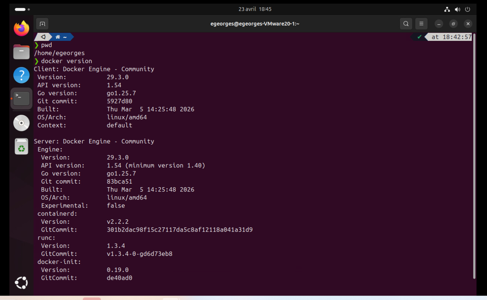
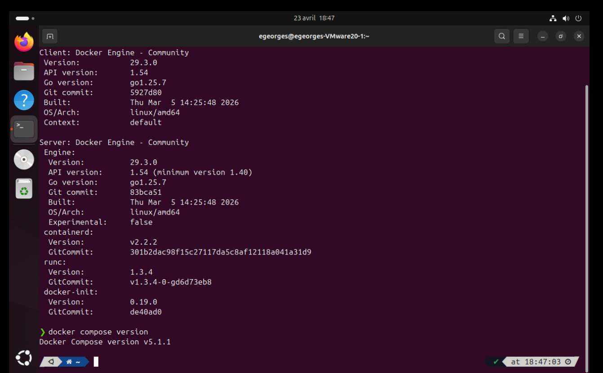

# tp2-420-w45-sf
Cours Installation Serveurs et Services - TP2

Nom : Eugénio Georges
Date : 2026-04-22

Description du projet (Tiré de l'énoncé de travail) :
Ce projet a pour but de :
- Démontrer l'installation d'un système de container docker;
- Configurer le sytème de container en fonction d'une utilisation sécuritaire;
- Vérifier que les éléments installés fonctionnent comme prévu;
- et enfin configurer les règles de gestion des accès sécuritaires


Section 1 - Étape 1 : Vérification et containers

Avant toute chose, nous allons véritier que les composants de Docker onté été bel et bien installés.
Il s'agit de deux cmoposants, Docker Engine et Docker Compose. Les commandes à utiliser pour ces vérifications sont les suivantes : 
    ```
    docker version
    ``` 
et 
    ```
    docker compose version
    ```. 

Une fois ces deux commandes exécutées, si les composants sont effectivement installés, les informations y associées sont affichées. la fenêtre affiche les détails semblables à ceux-ci :  et  


Section 1 - Étape 2
Création de containers et d'un réseau privé :

Dans cette section, nous allons démontrer la création de containers et d'un réseau local auquel sera associé les dits containers.
- Avec la commande suivante, nous procédons à la création d'un réseau privé nommé mon_reseau pour connecter des containers que nous allons éventuellement créer : 
    ```
    'docker network create -d bridge mon_reseau'
    ```

- Créer le volume de MongoDb : docker volume create mongoDb
    # Création du volume
    ```
    docker volume create mongodb
    ```
    # Vérification que le volume est bien créé
    ```
    docker volume ls
    ```
- Deux containers à créer : Apache, avec l'image httpd:latest et MongoDb avec l'image et un volume pour faire le montage de MongoDb 
    - Commandes utilisées pour le container Apache : 
        ```
        docker container run --publish 80:80 --net mon_reseau --detach --name apache httpd:latest
        ```

    Selon quelques indications de Google Gemini, "Le point de montage par défaut pour les données MongoDB est /data/db sur les systèmes Linux et macOS." Donc, notre montage sera fait sur le volume que nous avons créé avec le point de montage data/db.
    - Commande pour la création du container mongoDb :
        ```
        docker container run -v mongoDb:/data/db --publish 9000:9000 --net mon_reseau --detach --name mongodb mongodb/mongodb-community-server
        ```


Sites de référence : 
- Gemini pour la recherche de la méthode pour inclure une image dans un fichier README.MD;
- Documentation de Docker sur la création de réseaux privés : https://docs.docker.com/engine/network/


